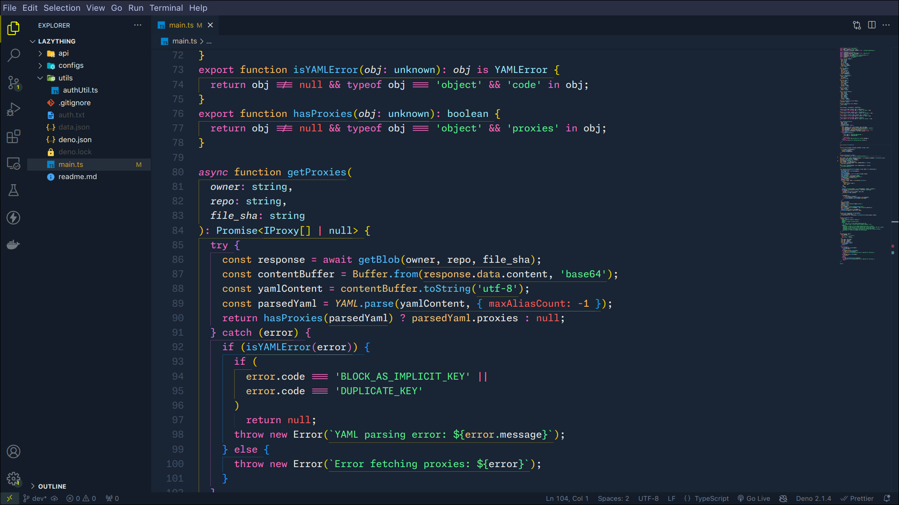

# Proto Monokai V

Visual Studio Code theme that combines the background aesthetics of Monokai One Dark Vivid with the syntax highlighting colors from the color-blind-vscode-theme.

## Style

- Fonts: [Monaspace Neon](https://github.com/githubnext/monaspace)
- Icons: [Material Icons](https://marketplace.visualstudio.com/items?itemName=PKief.material-icon-theme)

## Screenshots

## Acknowledgements

- [Color Blind Themes](https://github.com/goofygoobers/color-blind-vscode-theme)
- [Monokai One Dark Vivid](https://github.com/AshPowell/monokai-one-dark-vivid)
