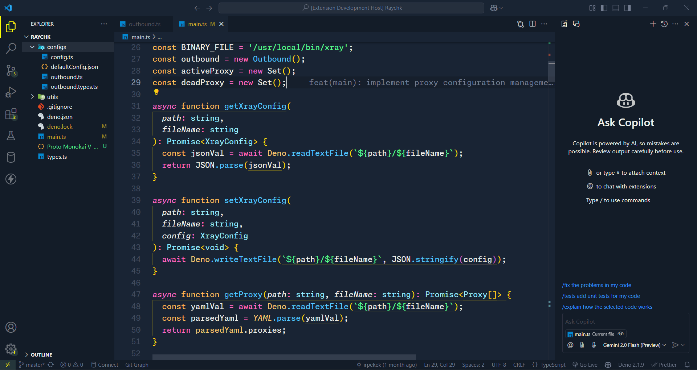

# Proto Monokai V

Visual Studio Code theme that combines the background aesthetics of Monokai One Dark Vivid with the syntax highlighting colors from the color-blind-vscode-theme.

## Screenshots

 

## Acknowledgements

 - [Color Blind Themes](https://github.com/goofygoobers/color-blind-vscode-theme)
 - [Monokai One Dark Vivid](https://github.com/AshPowell/monokai-one-dark-vivid)
